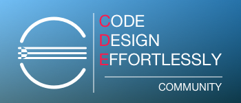
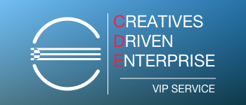
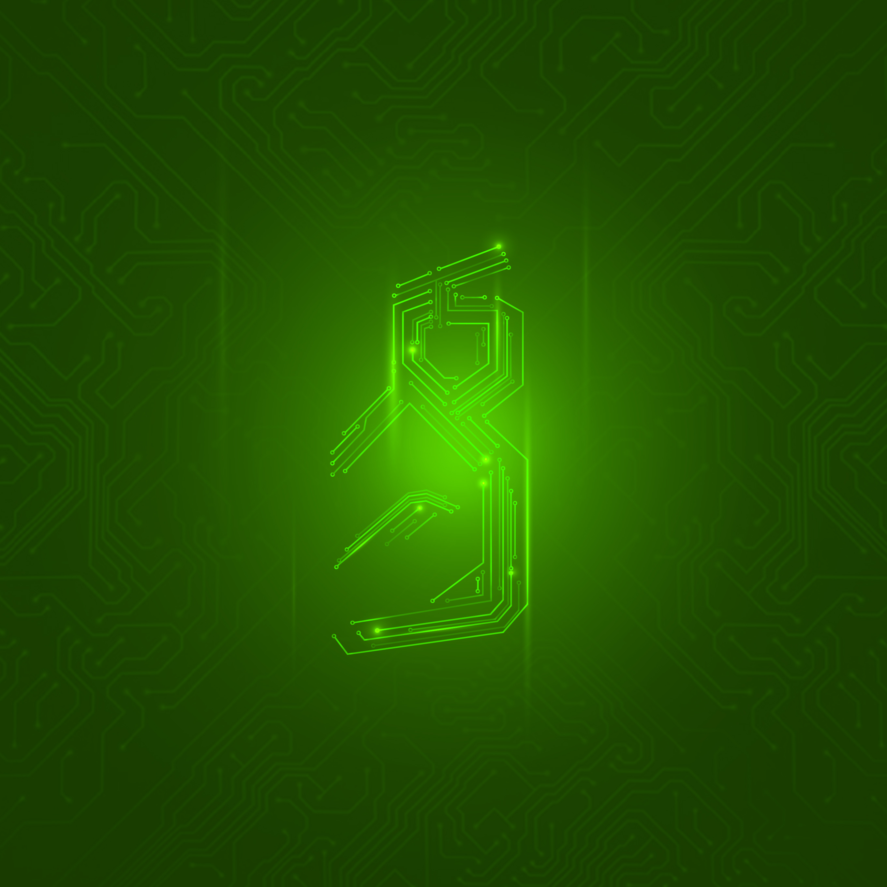
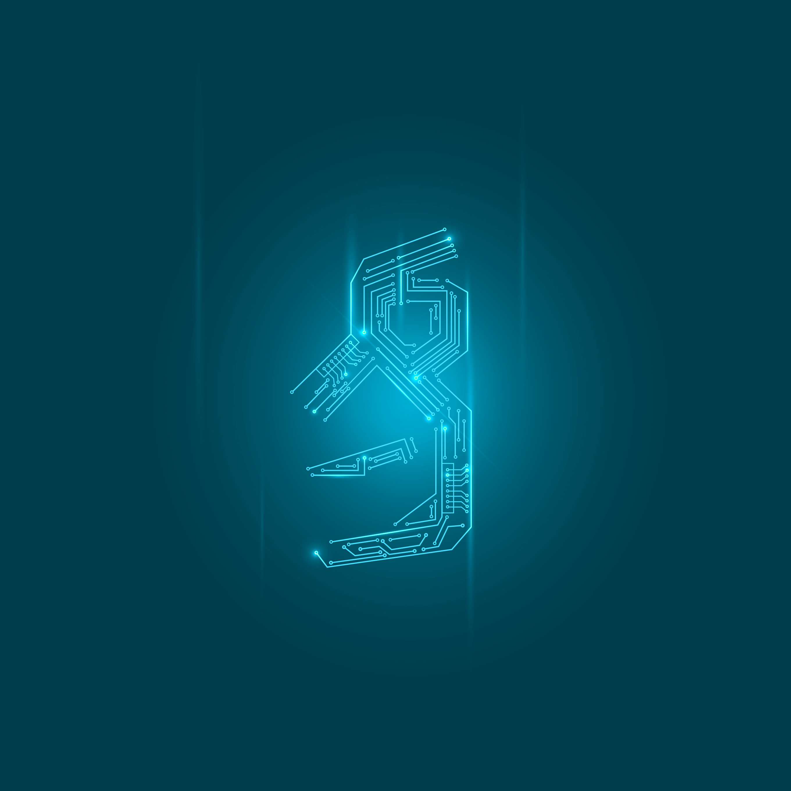
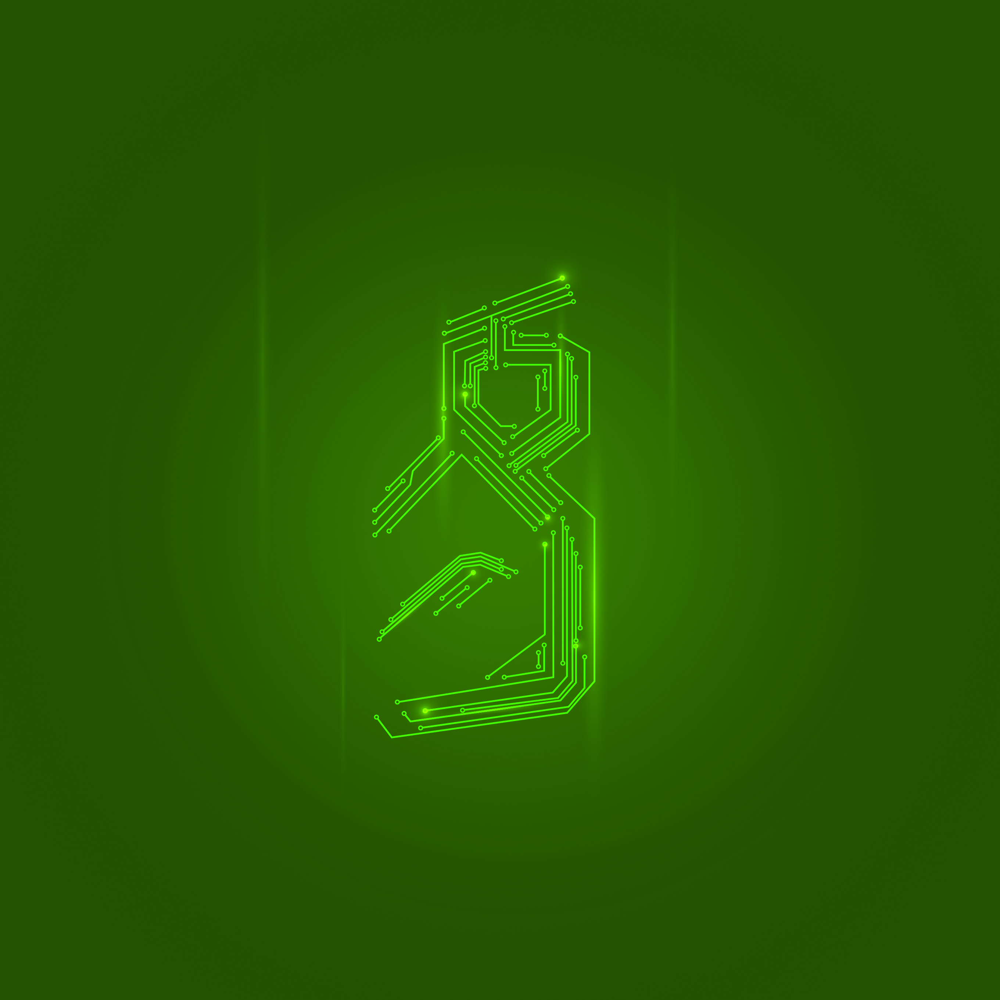
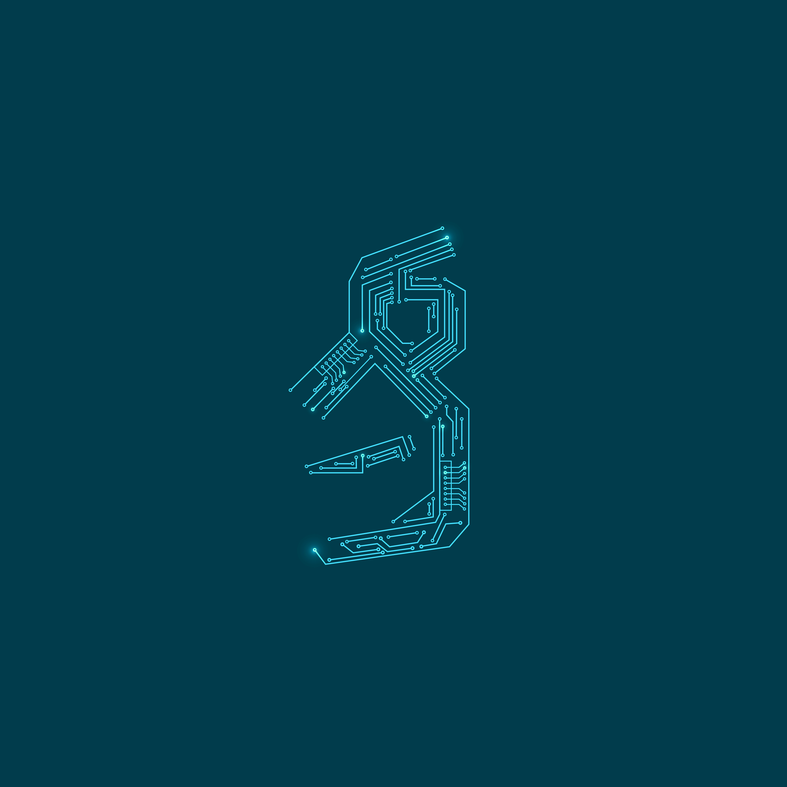
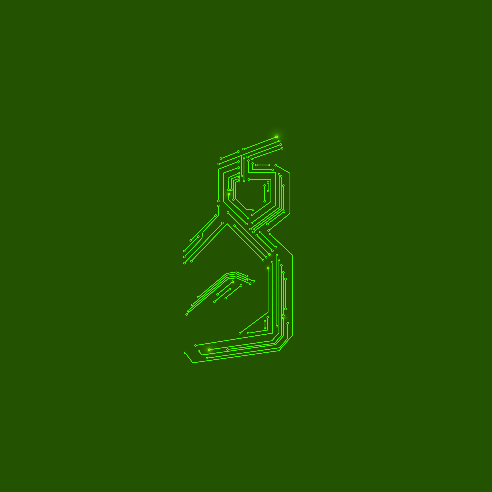
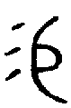

# 一、议题

讨论 Logo 和网站的相关事宜。

# 二、Logo

## 当前工作状态

### 方案一

#### 描述

方案一的几款 Logo 严重参考了 consul 的设计，线条相对简单，并机械的融入了对字母 C、D 和 E 的表达。最重要的是其采用藏头词的方式，用一句口号，隐含了这三个字母，并为社区和企业网站提供了不同版本。参考方案如下：

社区 Logo 对应的口号为：Code, Design, Effortlessly，翻译为：编码，设计，轻而易举

企业 Logo 对应的口号为：Creatives Driven Enterprise，翻译为：创意驱动企业

#### 意见汇总

1. Logo 过于简单、生硬
2. 没有很好的配色方案
3. 社区版的口号非常赞，而企业版的口号与社区版在结构上面还有些差别，可以再斟酌。例如另外几个参考版本是：Concentration, Development, Essentially，翻译为：专注，发展，由内而外；或 Collaborate, Develop, Effectively，翻译为：协作，发展，快人一步

### 方案二

#### 描述

方案二的几款 Logo，灵感来源于中国古代金文“易”字的一些写法，并以集成电子线路作为线条，力求增强 Logo 的科技感，几张参考资料如下：

设计后的 Logo 初稿：

#### 意见汇总

1. 设计还不够抽象，“易”字的影子太过强烈
2. 线条复杂，虽然易于识别，但不易于记忆和传播
3. 低分辨率环境下，显示不够友好
4. 字母 C、D 和 E 体现的不够明确

## 下一步工作

1. 对当前设计版本进行一些优化，作为备选方案之一
2. 重新参考一些案例，设计多一些版本

## 参考资料

目前搜集到的一些参考资料如下：

这也是金文“易”字的一个变体，看上去不那么具体，而且比较能够明显区分 C、D 和 E 三个字母。所有古文“易”字的参考资料可以在[这里](http://www.51bianji.com/zidian/e69893.html)找到。

这是另外一个大脑的造型，具有简单明快的线条设计，其中也可以找到那三个字母的影子。

这是一个联结的网状构图，中间通过颜色的描绘突出了要表达的主体。

# 三、网站

## 当前工作状态

1. 进行了简单的需求设计
2. 进行了一些技术研究

### 方案一：开源社区网站和企业服务网站分开

#### 描述

开源网站使用 cde.io 域名，主要突出平台的开源特性，面向开发人员介绍平台的功能与用法，并提供一些社区化的支持手段。主要板块包括：简介及下载、与开发人员相关的功能特色、快速上手、文档、社区以及到企业服务和 Github 的链接。

企业服务网站使用 cde.vip 域名，主要突出在平台的基础上为客户提供的各种专业化服务。主要板块包括：成功案例、获益、培训服务、按需定制服务、技术支持和合作伙伴等。

参考案例：https://www.consul.io 和 https://www.hashicorp.com/consul.html。

#### 意见汇总

1. 在目前网站访问量不是很大的情况下，分开两个站点会使流量分散
2. 目前网站没有太多内容，且也不会经常更新，分开两个网站会显得每个网站的信息量都太少
3. 维护两个网站成本也相对较高
4. 优势在于分类清晰，便于特定目的的访客找到特定的网站，并且每个单一网站的主题都明确且突出

### 方案二：只有统一的一个网站

#### 描述

统一的一个网站就使用 cde.vip 作为主域名，而 cde.io 以后用作有可能提供的 SaaS 类服务的入口。网站的具体内容就是将两个网站的内容进行适当的合并，代表网站是 docker.com。

#### 意见汇总

1. 利于流量的集中
2. 一个网站显得内容更加充实
3. 不同目的的访客访问同一个网站有可能造成获取信息的困难，或不知所措，这需要在交互式设计方面投入更多精力
4. 而且在开始 SaaS 服务之前，还是以专业化的企业服务为主，因此商业模式跟 docker 非常类似，以开源推动企业服务的发展

## 其他参考网站

* https://countryos.com/
