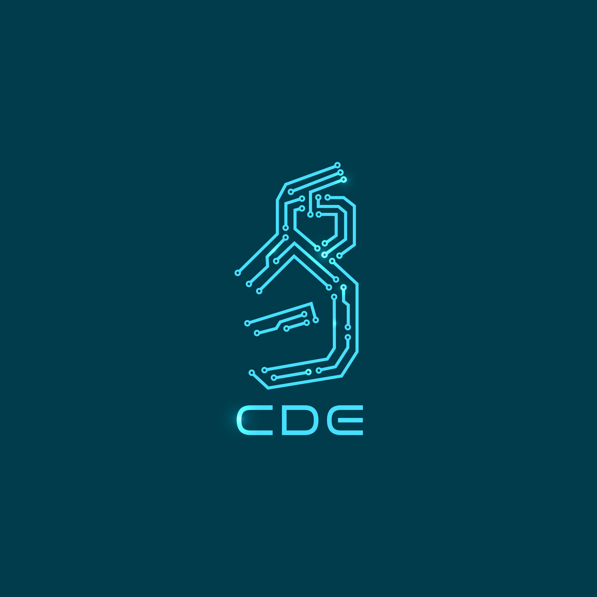
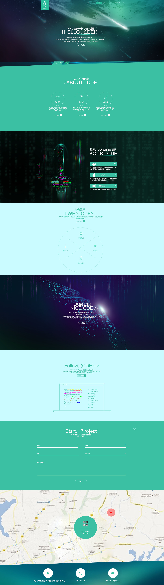

# 一、议题

讨论 Logo 和网站的相关事宜。

# 二、Logo

## 当前工作状态

在 [2016-07-09](../2016-07-09) 会议的基础上修订了方案二，结果如下：

该版本较以前有了明显的提升，在保持设计元素不变的前提下，线条更加简洁，而且添加上 CDE 三个字母以后，科技感更加强烈。

## 意见汇总

1. Logo 整体形状更趋向于原始文字，因此会让读者把精力集中在识别汉字上，因此可以考虑在此基础上，将汉字字形部分进一步抽象，只保留神韵，以更加突出 Logo 的抽象性
2. 这个 Logo 整体上是竖长的，这样的 Logo 恐怕会对后续 VI 的设计造成困难，应该尽量往方形或横长的方式发展（该意见仅供参考）
3. 低分辨率时候的表现如何

## 下一步工作

1. 根据现有的感觉，尝试按照 [2016-07-09](../2016-07-09) 会议记录上的“金文易字 1”和“金文易字 3”再设计两款 Logo，以做对比（注意：不要完全临摹字体，而是应该保持神韵的同时抽象）
2. 标注 Logo 中使用的辅助线，以及相关元素的尺寸
3. 确定配色：彩色、灰度、黑白和反白，尤其是彩色版，可以尝试由不同颜色的线条构成
4. 根据此 Logo 设计一些衍生品，以测试 Logo 的整体效果
5. 根据选定的 Logo 设计整体的 VI

# 三、网站

## 当前工作状态

目前有一稿设计如下，下面的阐述均基于该版设计。

该版设计已经初步具有了相应的感觉，但是应该在网站本身的叙事性上再下功夫。这版设计以绿色和黑色搭配，本身就象征着虚拟世界，是一个不错的开端，但是绿色的选取还需要进一步斟酌。

第一幅图片，展现了一个星球和流星雨的场景。这个场景单纯来看貌似和软件扯不上什么关系，所以我们需要一些延伸。我们可以把星球想象为一个神秘的未知世界，这个世界是我们要到达的目的地，用项目管理中的术语来讲就是“需求”，而周围的那些流星雨可以假象为天然的屏障，寓意想要进入这个向往中的目标世界，需要突破层层困难。基于这个设定，那么这个星球就不应该是以地球为蓝本涉及，而且为了体现与软件的相关性，应该增加一些数字或者软件有关的内容。例如变形金刚里面的赛博坦星球。

第二幅图片，以数字瀑布作为背景，虽然能够体现软件这个概念，但是实在被用太多了，体现不出来新意，而钥匙这样的概念也有些传统。那么我们可以继承上一幕的场景，让流星雨拓展到这幅图上作为背景。那么既然我们有了一个未知的星球作为目标，显然这里不应该是一把钥匙，而应该是一艘舰船，以及庞大的舰队。这个舰队就可以影射为我们的平台，以我们的平台作为工具，让用户能够突破困难，到达理想中的目的地。

第三幅图片，如果不添加注释的话，这些亮点可以想象为星空，而那个强光自然是日出。继续上面的构想，这是乘坐我们的宇宙飞船，突破流星雨的屏障以后，降落到那个未知星球时，从地面上看到的景象。昔日的流星雨变成了璀璨如极光的空中点缀，而日出映射新的希望正在冉冉升起。这幅图结合平台，就是使用平台能够为用户带来的收益。另外这幅图片应该与其他图片使用相同的色系，否则单独一张会显得很突兀。
