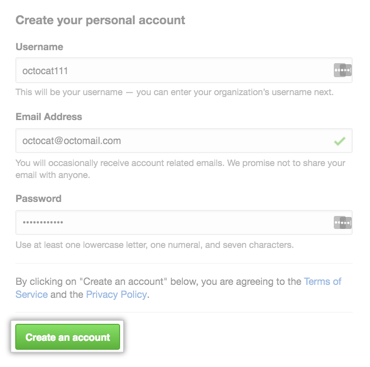

**注：以下内容如无特别说明，均可参考 github 的相关功能。**

# 用户账号注册

用户可自行申请注册账号。注册账号时需要提供用户名、密码和邮箱。

用户验证邮箱后，账号方可激活，并将此邮箱设置为默认邮箱。

# 用户登录

用户使用注册时提供的用户名和密码进行登录。

# 用户档案管理

## 查看档案信息

用户登录以后可以查看个人信息档案。档案内容包括：登录名、用户姓名、个人介绍、
公司、主邮箱、个人网站、注册日期、用户头像等。

## 编辑档案信息

在查看个人档案的界面上可以点击"编辑“按钮对档案内容进行编辑。

### 基本信息

个人档案的基本信息包括：头像、姓名、邮箱、简介、个人网站、公司、所在地等。

### 账户信息

变更密码、变更用户名、删除账户。

### 邮箱信息

添加新邮箱、设置默认邮箱、删除邮箱。

### 手机信息

添加新手机号码、设置默认手机号码、删除手机号码。

### 安全

会话信息、安全日志。

### 项目

所有项目列表。
