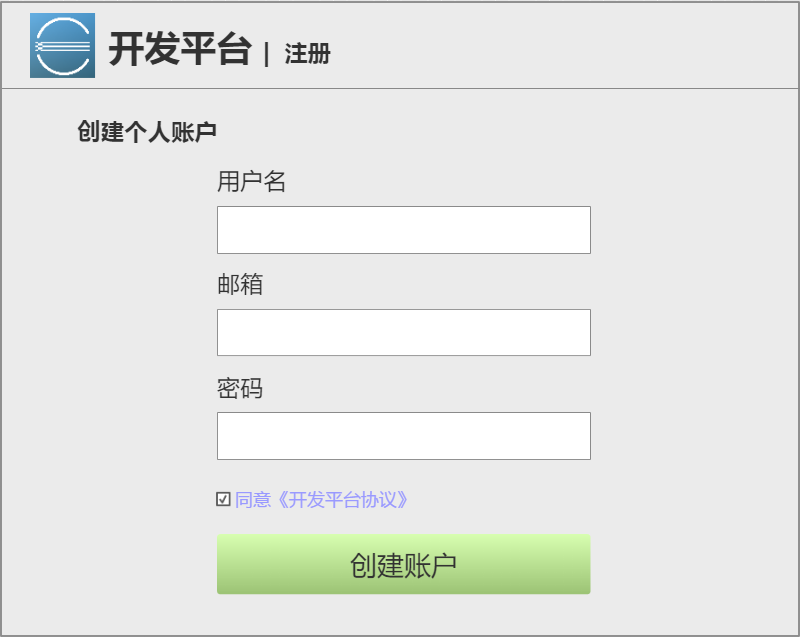
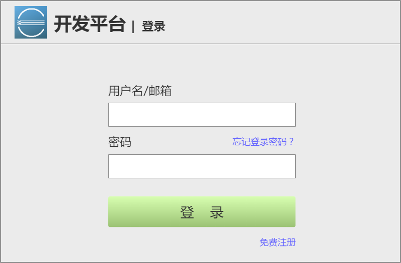
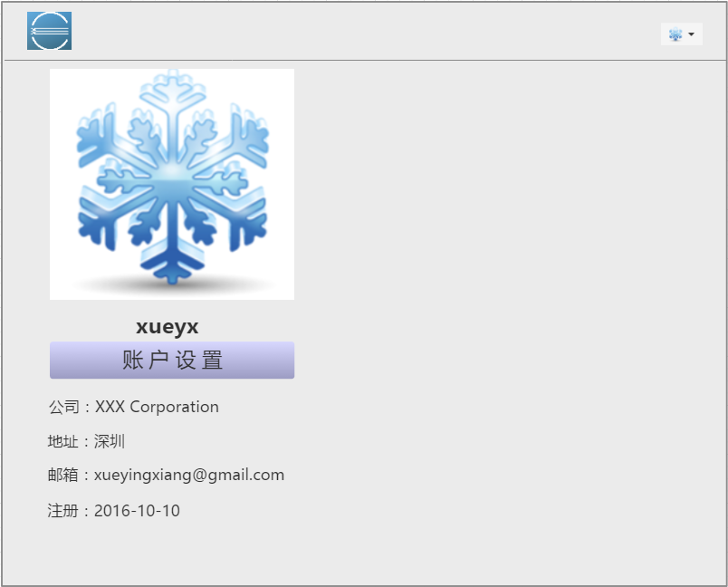
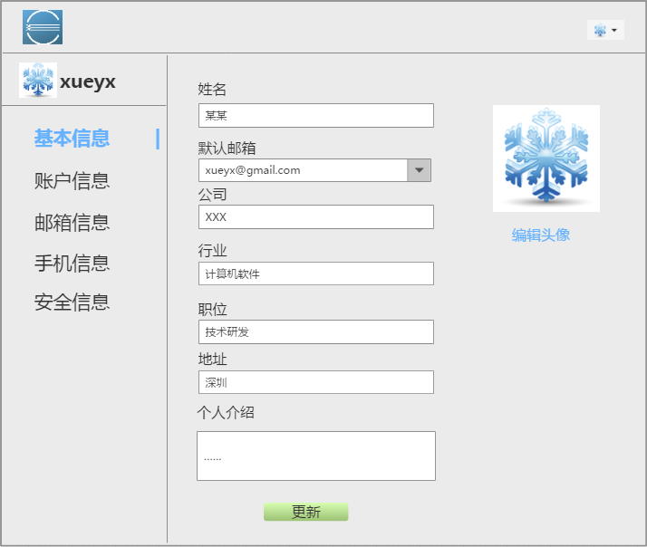
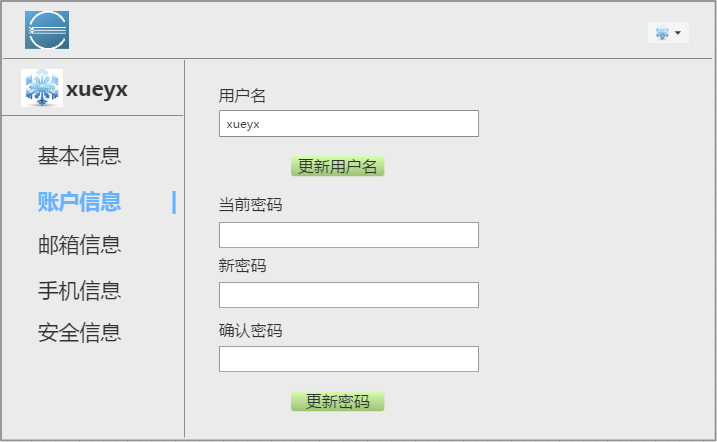
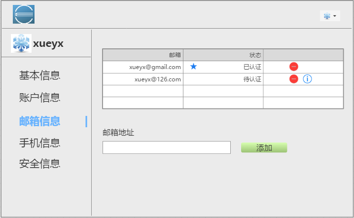
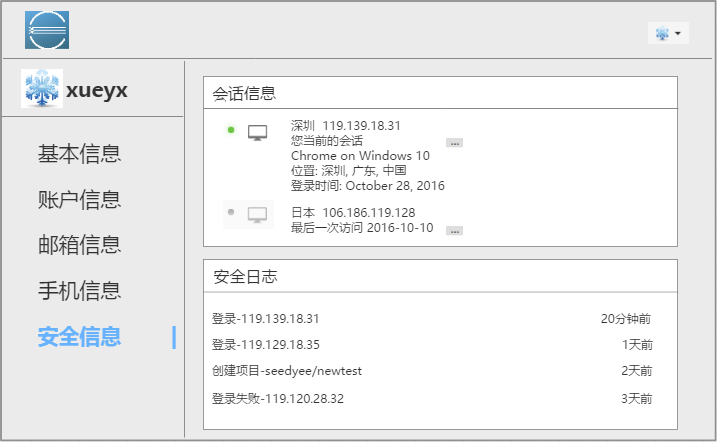

**注：以下内容如无特别说明，均可参考 github 的相关功能。**

# 用户账号注册

用户可自行申请注册账号。注册账号时需要提供用户名、密码和邮箱。

用户验证邮箱后，账号方可激活，并将此邮箱设置为默认邮箱。

注册页面需验证用户名和邮箱的唯一性，如已注册给出相应提示消息。

####注册异常提示：

* 请输入正确格式的邮箱地址
* 当前邮箱已被使用，请您尝试其他邮箱
* 密码有效长度为6-24位
* 用户名已被使用，请重新输入

# 用户登录

用户使用注册时提供的用户名/邮箱和密码进行登录。

####登录异常提示：

* 请输入您的用户名或邮箱地址
* 您输入用户名或邮箱不存在，请重新输入
* 请输入您的密码
* 您输入的密码错误，请重新输入

# 用户档案管理

## 查看档案信息

用户登录以后可以查看个人信息档案。档案内容包括：登录名、用户姓名、个人介绍、
公司、主邮箱、个人网站、注册日期、用户头像等。

## 编辑档案信息

在查看个人档案的界面上可以点击"编辑“按钮对档案内容进行编辑。

### 基本信息

个人档案的基本信息包括：头像、姓名、公开邮箱、公司、行业、职位、地址、个人介绍等。

### 账户信息

变更密码、变更用户名。

### 邮箱信息

添加新邮箱、设置默认邮箱、删除邮箱。

### 手机信息

添加新手机号码、设置默认手机号码、删除手机号码，同上邮箱信息页面。

### 安全信息

包括会话信息、安全日志。

### 项目

所有项目列表。
