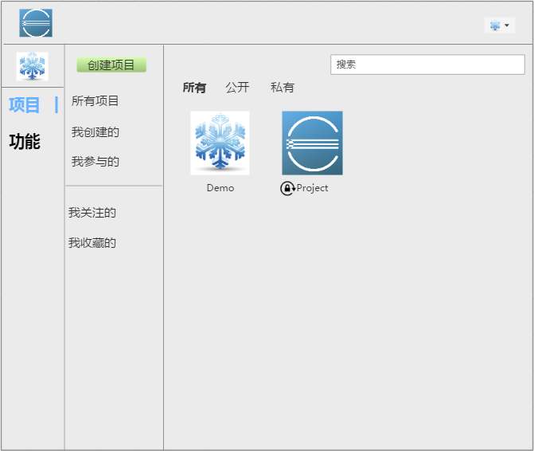
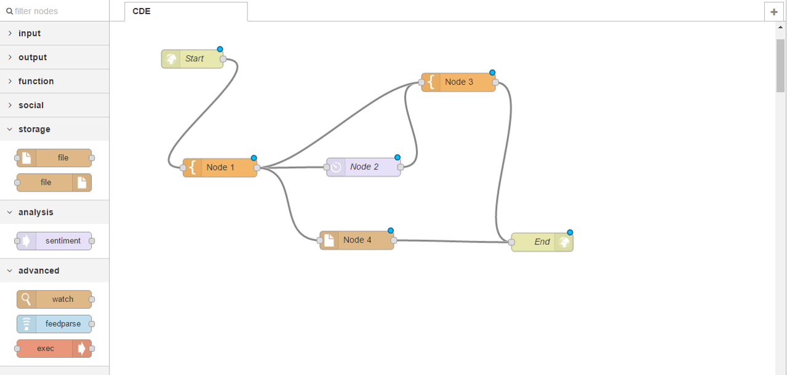

# 项目管理

一个账号可以创建多个项目，一个项目可以添加多个项目成员。

###项目概览
点击菜单项目菜单，进入项目概览页面，可查看项目基本信息、项目内成员信息。

**1.项目信息**

创建人/组织（默认当前账号）、项目名称、项目描述、公开/私有、初始化仓库（启用README、ignore文件、license文件）等。

**2.项目成员**

* 项目所有者有权限添加项目成员，目前暂不做数量限制（后期可做增值服务）。
* 支持邮箱和用户名搜索添加。

###创建项目

用户登录之后，可进入新建项目操作流程。

创建项目可以录入项目信息以及添加项目成员。

###更新项目

项目所有者有权更新项目信息和项目成员。

###删除项目

项目所有者有权删除项目。 

点击删除项目，需通过身份验证（输入登录密码），才能删除该项目。

###转让项目

项目所有者有权转让项目。 

点击转让项目，选择项目成员，需通过身份验证（输入登录密码），才能转让该项目给指定项目成员。

##用户与项目关系
* 我创建的
* 我参与的
* 我关注的
* 我收藏的

##组件
一个项目可包括多个组件（模块），一个组件（模块）由多个小组件关联而成。

